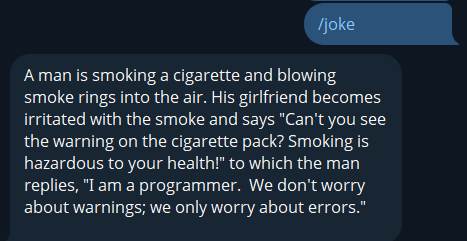

# Titanio-Rust-Telegram-Bot

Titanio is a fun, modular Telegram bot written in [Rust](https://www.rust-lang.org/) using the [`teloxide`](https://docs.rs/teloxide) framework. It's a great starting point for building bots with async Rust!


## 🚀 Features

- [x] Built with Rust, [`teloxide`](https://github.com/teloxide/teloxide) framework and [`tokio`](https://tokio.rs/) for async concurrency
- [x] Modular command handling (`/help`, `/weather`, `/joke`, `/ping`, etc.)
- [x] Environment-based config with `.env`
- [x] Clean, beginner-friendly project structure
- [x] Uses external APIs (like JokeAPI and wttr.in) with no login required


## 📦 Requirements

To run the bot, make sure you have:

- 🦀 [Rust](https://rustup.rs/) (use `rustup` to install)
- 🔐 A Telegram bot token (from [@BotFather](https://t.me/BotFather))
- 📄 A `.env` file with your token and optional API keys


## 🛠️ Setup

1. **Clone the repo**

```bash
git clone https://github.com/LoboGuardian/titanio-rust-telegram-bot.git
cd titanio-rust-telegram-bot
```

2. **Create a .env file**

In the root folder, create a .env file that looks like this:

```ini
TELOXIDE_TOKEN=your_telegram_bot_token_here
# Optional: other keys like weather API
```

3. **Run the bot**

```bash
cargo run
```

Your bot is now alive and rolling dice in reply to messages it receives! 🎉

## 📁 Project Structure

```bash
.
├── Cargo.toml         # Project metadata and dependencies
├── .env               # Environment variables (not committed)
├── README.md          # You're reading it!
├── LICENSE            # MIT License
└── src
    ├── main.rs        # Bot entry point and command dispatcher
    └── commands/      # Modular handlers for each command
        ├── about.rs
        ├── echo.rs
        ├── help.rs
        ├── id.rs
        ├── joke.rs
        ├── mod.rs
        ├── ping.rs
        ├── roll.rs
        ├── start.rs
        ├── time.rs
        └── weather.rs
```

## 💬 Supported Commands

| Command           | Description                                 |
|-------------------|---------------------------------------------|
| `/start`          | Greet the user                              |
| `/help`           | Show available commands                     |
| `/about`          | Info about the bot                          |
| `/echo <text>`    | Echo back your message                      |
| `/roll`           | Roll a Telegram dice                        |
| `/id`             | Show your user ID and chat ID               |
| `/time`           | Show the current server time                |
| `/ping`           | Check if the bot is alive                   |
| `/joke`           | Tell a random joke                          |
| `/weather <city>` | Show weather info via wttr.in               |

>   Want more? You can easily add /quote, /cat, /translate, or even /todo with just a bit of async Rust!

## 🛠 Tech & Crates Used

- [`teloxide`](https://docs.rs/teloxide) – Telegram Bot framework
- [`tokio`](https://tokio.rs) – async runtime
- [`dotenv`](https://docs.rs/dotenv) – load .env config
- [`reqwest`](https://docs.rs/reqwest) – HTTP client for APIs
- [`serde`](https://serde.rs) – JSON deserialization
- [`log`](https://docs.rs/log),[`pretty_env_logger`](https://docs.rs/pretty_env_logger)  – logging

## 🃏 A joke

Why not?



## 🦀 Why Rust?

Rust is fast, safe, and makes writing concurrent code a breeze. This bot project is a great way to learn about:

- Async/await
- External APIs
- Modular design in Rust
- Telegram bot development

> New to Rust? Check out the [Rust Book](https://doc.rust-lang.org/book/). It’s free and amazing!

## 📄 License

This project is licensed under the [MIT License](LICENSE).

Built with 🦀 and ❤️ for Telegram.